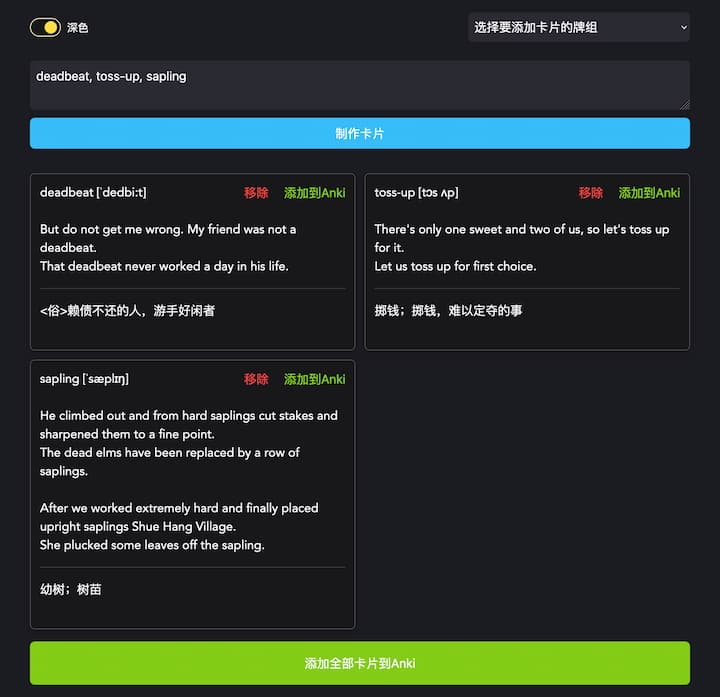

# Anki Easy

## 背景
个人的英语词汇量到达了一个瓶颈，大部分不认识的词汇由于出现频率不高，难以再通过“自然而然”的方式吸收。是时候下点功夫去“死记硬背”。
Anki是一个非常好的记忆工具，但是制作卡片是一件很繁琐的事情。为了不在制作卡片上浪费太多时间，于是有了这个应用。
和大多数个人项目一样，虽然只是一个很简单的功能，但出于学习目的进行，在应用里折腾了一些不是很重要或根本不必要的东西。

## 用途
输入需要记忆的英语单词，自动制作卡片，一键添加到Anki中。

## 使用方法
设备上需要安装有Anki客户端，并添加[AnkiConnect](https://ankiweb.net/shared/info/2055492159)这个插件。
运行本应用的`dev`命令，并在浏览器中访问。

## 截图
 
